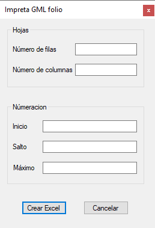

# Imprenta de Folios - Windows Forms App

## Descripción
Esta aplicación de Windows Forms, desarrollada en C#, facilita la generación de una matriz de números en un archivo de Excel. Es ideal para la creación de folios con números correlativos y personalizados, ofreciendo una interfaz intuitiva para la configuración de los parámetros de impresión.

## Características
- **Generación Personalizada de Matriz de Números**: Permite crear una matriz de números con parámetros definidos por el usuario.
- **Exportación a Excel**: Los números generados se exportan fácilmente a un archivo de Excel, lo que permite una impresión y manipulación eficiente.
- **Validación de Entrada**: Asegura que solo se ingresen números enteros en los campos de entrada.

## Parámetros de Entrada
- **Inicio**: Número inicial de la secuencia.
- **Salto**: Incremento entre cada número en la secuencia.
- **Máximo**: Número máximo hasta donde llegará la secuencia.
- **Filas**: Número de filas en la matriz.
- **Columnas**: Número de columnas en la matriz.

## Botones
- **Crear**: Al hacer clic en este botón, se genera la matriz de números basada en los parámetros ingresados y se abre un cuadro de diálogo para guardar el archivo Excel.
- **Cancelar**: Este botón cierra la aplicación.

## Uso del Programa
Para utilizar el programa, siga estos pasos:
1. Descargue el archivo `ejecutable.zip` que se encuentra en la raíz del repositorio.
2. Descomprima el archivo y ejecute `folio.exe`.

## Requisitos
- Microsoft Windows
- .NET Framework
- EPPlus (para la manipulación de archivos Excel)

## Contribuciones
Las contribuciones son bienvenidas. Si tienes alguna sugerencia o corrección, no dudes en abrir un 'issue' o un 'pull request'.

## Licencia
[Incluir detalles de la licencia aquí]

## Contacto
[Información de contacto del desarrollador]

---

Recuerda reemplazar `[Información de contacto del desarrollador]` con la información correspondiente.
